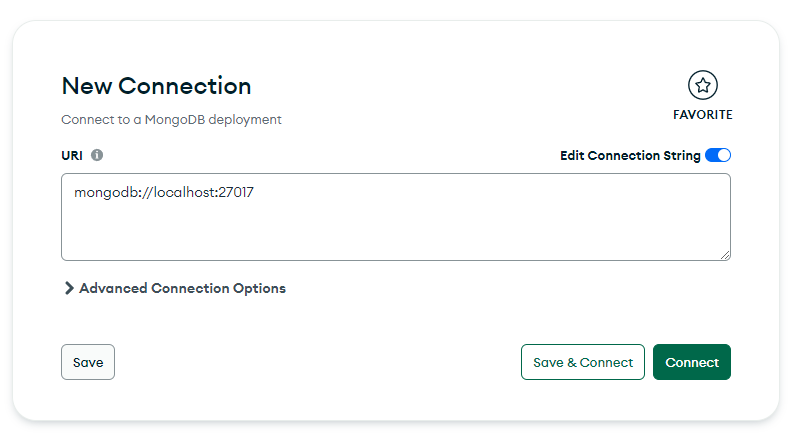

# Simple Search Engine Backend

## Installation

SDK: Oracle OpenJDK version 17.0.6  
MongoDBCompass: version 1.36.4

## Getting started

1. Create new connection using MongoDBCompass  
   Set up the Connection String URI and click the Connect button  
   By default,the Connection String URI is `mongodb://localhost:27017`

   

2. Set up [application.properties](src/main/resources/application.properties)  
   Default value:  
   `spring.data.mongodb.database=${MONGO_DATABASE}`: the name of the database  
   `spring.data.mongodb.uri=mongodb://localhost:27017/`: the Connection String URI  
   `spring.data.mongodb.auto-index-creation:true`: automatically create indexes for the collections  
   `server.port=8080`: the port that the backend will run on

3. Set up [.env](src/main/resources/.env)  
   Default value:  
   `MONGO_DATABASE=simple-search-engine-db`: the name of the database that will be created in MongoDBCompass

4. `./mvnw spring-boot:run` to run the backend

[Optional]

- `.\mvnw test` to run the JUnit tests
- `.\mvnw install jacoco:report` to generate Jacoco test coverage report

# Collections

- [X] Implement `words` collection
- [X] Implement `documents` collection
- [X] Implement `postings` collection
- [X] Implement `parentLinks` collection
- [X] Implement `termWeights` collection
- [X] Implement `pageRanks` collection

# Crawler

- [X] Implement crawler
    - [X] Create api endpoint `api/v1/crawler`
        - Query params:
            - url: url to crawl  
              Default value: https://cse.ust.hk/
            - pages: number of pages to crawl  
              Default value: 30

# Vector Space Model

- [X] Implement term weighting formula based on `tf*idf/max(tf)`
- [X] Implement Document Similarity based on cosine similarity measure
- [X] Implement mechanism to favor matches in title
- [X] Create api endpoint `api/v1/searchEngine`
    - [X] Return top-50 query results
- [X] Implement phrase search
    - [X] Implement bi-gram terms
    - [X] Implement tri-gram terms
    - [X] Parse query to find phrase terms
 